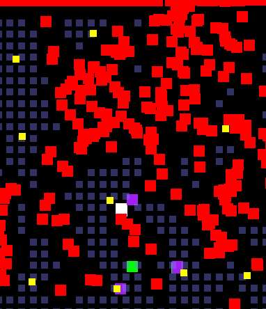
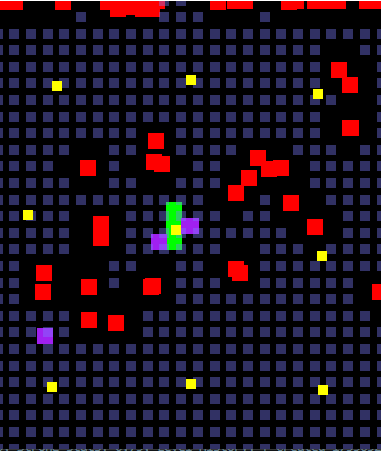
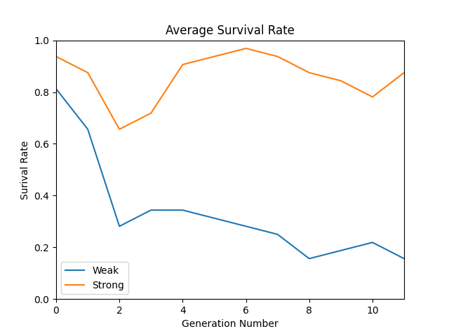
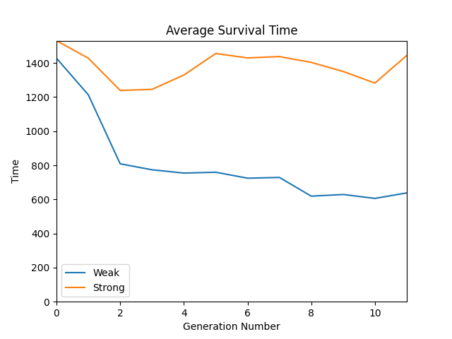
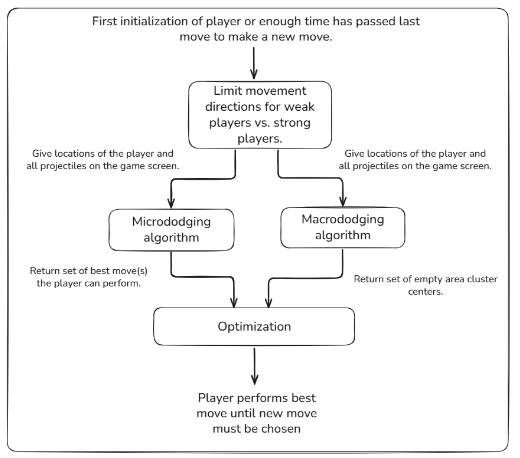
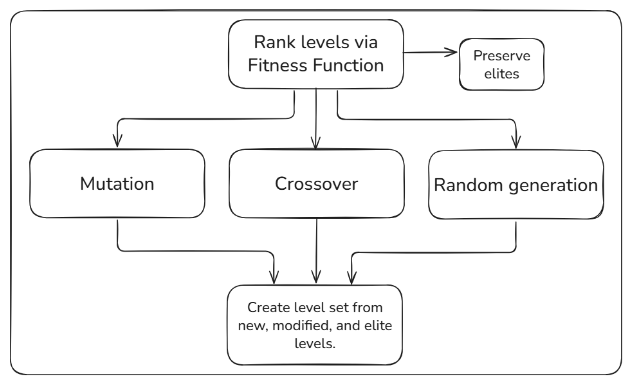

Conditionally Solvable Shmup Level Generation
============

## What is this?

This is a simulation environment for creating *Conditionally Solvable Bullet Hell Levels*.

## Quick Introduction

The Bullet Hell Visualizer project aims to create conditionally solvable levels for 'Bullet Hell' games, which are a subset of the Shoot'em Up (shmup) genre. Sets of levels are generated according to a genetic algorithm, then these generated levels are tested with "strong" and "weak" players.
- "Strong" players: Have 9 directions of movement.
- "Weak" players: Have 5 directions of movement.
The aim here is *conditionality*, that is, strong players should eventually be able to beat generated levels, while weak players cannot.

### Prerequisites

- **Python 3.8** or higher
- **Pygame**
- **graphics.py**
- **numpy**
- **scipy**
- **matplotlib**

### Running

Run the file **main.py** with **python main.py**.

### Usage

The output of the program includes a live graph that updates as new results are evaluated. 

### Examples

<!--  -->
<!--  -->
 
<!--  -->
<!--  -->
 

## Structure

The Bullet Hell Visualizer's code is broken into several components:

***Evaluator***

<!--  -->

Levels are evaluated using a player model created based on strategies used by Bullet Hell gamers. There are many possible strategies that could have been chosen, however, only two are used here:
- Micrododging
“Micrododging” is a bullet hell concept that refers to a strategy where a player is [“precisely weaving your way through enemy projectiles, focusing on a small portion of the screen and threading yourself through the small openings in the pattern with delicate, subtle movements”](https://www.google.com/url?q=https://shmups.wiki/library/Help:Glossary%23Micrododging.2FMacrododging&sa=D&source=docs&ust=1756270386557237&usg=AOvVaw2KQ1ajQots4WoOJirbN4aP)
This strategy is implemented in this project through a greedy search algorithm called the ["Constrained Velocity Obstacle Algorithm"](https://github.com/Netdex/twinject?tab=readme-ov-file#constrained-velocity-obstacle-algorithm) or CVOA, a coin termed by Netdex (as far as I am aware) and used for the Touhou bot [Twinject](https://github.com/Netdex/twinject?tab=readme-ov-file).

- Macrododging
“Macrododging” is a bullet hell concept referring to a strategy where a player focuses [“on the entire screen in order to find larger openings or blind spots that allow them to avoid the bullet pattern entirely with large quick movements”](https://www.google.com/url?q=https://shmups.wiki/library/Help:Glossary%23Micrododging.2FMacrododging&sa=D&source=docs&ust=1756270386557237&usg=AOvVaw2KQ1ajQots4WoOJirbN4aP)
This strategy is implemented in this project through using a K-means clustering algorithm. How it works is that the algorithm first divides the screen into grid cells. Each grid cell is then checked to see if a bullet occupies it. Finally, the K-means clustering is run on all empty grid cell locations. Ideally, this will allow the returned cluster centers to point towards patterns of empty space, which are desirable goal positions our player should move towards, at least according to the macrododging strategy.

These two strategies, Micrododging and Macrododging, are then combined into one cohesive player model by doing the following:

> The player goes through each best move.  
> It checks the distance of the closest cluster center, given the player had performed that best move.  
> If a given move has the smallest distance to a cluster center, then choose that move.  
> If several different moves share the smallest distance, then randomly choose a move from the set of moves with the smallest distance.

This forms our final player model.

***Generator***

<!--  -->

Via the use of a genetic algorithm, a set of levels are generated based on the feedback given by the players.
The key focus here is the average time differnce between how long the strong player vs weak players survived. Since the goal is to have levels solvable for one but not the other, the goal is to have this difference value grow.
Furthermore, if a level has 100% strong player survive and 0% weak players survive, then regardless of the time difference this already fulfills our conditionality requirement, those levels that are like this, or have a high enough difference are added to a set of elites and preserved.

There are three parts to the genetic algorithm:
- Selection
This is based on the difference between the average survival time for all strong vs weak players for that level.
- Mutation
This returns a mutated elite level.
- Crossover
This combines a elite level with a non-elite level. Ideally, this would allow for some stagnation avoidance.

Note that the the genetic algorithm here has a strong focus on elitism, which can be noticeable in generations past the 15~20 mark where stagnation becomes more apparent.

***Main loop that sequences the Evaluator and Generator***

<!--  -->

With the Evaluator and Generator component, the overarching flow of the program is as follows:
1. At program start, randomly generate a set of levels.
2. Pass a generated level to a single process, and run many simulations at once.
3. In each simulation, two equal set of strong and weak players are simulated.
4. Once simulation has been finished, the process sends the playtest data back to the main thread, and closes.
5. If all levels in a set have been evaluated, then run the genetic algorithm based generator.
6. Repeat steps #2~5 until program is stopped.

## Contributing
Contributors are welcome?

<!-- ## License -->